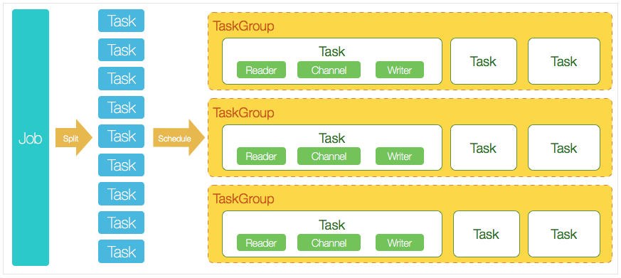

# Datax


## **一、背景：**

数据采集需求不断增加：

1. 各类结构化数据（oracle、mysql、sqlserver）
2. 日志采集（accesslog、service log）
每日采集总量越来越大，采集任务数越来越多，任务调度情况更加复杂

现有的采集工具存在一些缺陷：

1. 闭源商业软件，不支持二次开发，个性化需求很难满足

2. tdt目前不支持多节点高可用，单节点故障之后采集会中断

3. jdbc连接数限制，采集速度慢，采集大表会失败

4. 只能在图形界面单表配置，无法整库采集


## 二、datax简介

​    DataX 是阿里巴巴集团内被广泛使用的离线数据同步工具/平台，实现包括  MySQL、Oracle、SqlServer、Postgre、HDFS、Hive、ADS、HBase、TableStore(OTS)、MaxCompute(ODPS)、DRDS 等各种异构数据源之间高效的数据同步功能。

​    DataX在阿里巴巴集团内承担了所有大数据的离线同步业务，并已持续稳定运行了6年之久。目前每天完成同步8w多道作业，每日传输数据量超过300TB。

## 三、DataX原理

[参考资料1]: https://blog.csdn.net/weixin_43550228/article/details/88823710 "CSDN"
[参考资料2]: https://github.com/alibaba/DataX "github"

### 3.1DataX框架设计


​    采用Framework + plugin架构构建。将数据源读取和写入抽象成为Reader/Writer插件，纳入到整个同步框架中。

- ​    Reader：Reader 为数据采集模块，负责采集数据源的数据，将数据发送给Framework。
- ​    Writer： Writer 为数据写入模块，负责不断向Framework取数据，并将数据写入到目的端。
- ​    Framework：Framework用于连接reader和writer，作为两者的数据传输通道，并处理缓冲，流控，并发，数据转换等核心技术问    题。

### 3.2DataX核心构架



- DataX完成单个数据同步的作业，称之为Job，DataX接受到一个Job之后，将启动一个进程来完成整个作业同步过程，DataX Job模块是单个作业的中枢管理节点，承担了数据清理、子任务切分(将单一作业计算转化为多个子Task)、TaskGroup管理等功能。
- DataXJob启动后，会根据不同的源端切分策略，将Job切分成多个小的Task(子任务)，以便于并发执行。Task是DataX作业的最小单元，每一个Task都会负责一部分数据的同步工作。
- 切分多个Task之后，DataX Job会调用Scheduler模块，根据配置的并发数据量，将拆分成的Task重新组合，组装成TaskGroup(任务组)。每一个TaskGroup负责以一定的并发运行完毕分配好的所有Task。
- 每一个Task都由TaskGroup负责启动，Task启动后，会固定启动Reader—>Channel—>Writer的线程来完成任务同步工作。
- DataX作业运行起来之后， Job监控并等待多个TaskGroup模块任务完成，等待所有TaskGroup任务完成后Job成功退出。


**DataX调度案例：**

举例来说，用户提交了一个DataX作业，并且配置了20个并发，目的是将一个100张分表的mysql数据同步到odps里面。	DataX的调度决策思路是：

1. DataXJob根据分库分表切分成了100个Task。
2. 根据20个并发，DataX计算共需要分配4个TaskGroup。
3. 4个TaskGroup平分切分好的100个Task，每一个TaskGroup负责以5个并发共计运行25个Task。

### 3.3插件视角看任务调度

框架按照如下的顺序执行`Job`和`Task`的接口：


上图中，黄色表示`Job`部分的执行阶段，蓝色表示`Task`部分的执行阶段，绿色表示框架执行阶段。


- `Job`: `Job`是DataX用以描述从一个源头到一个目的端的同步作业，是DataX数据同步的最小业务单元。比如：从一张mysql的表同步到odps的一个表的特定分区。
- `Task`: `Task`是为最大化而把`Job`拆分得到的最小执行单元。比如：读一张有1024个分表的mysql分库分表的`Job`，拆分成1024个读`Task`，用若干个并发执行。
- `TaskGroup`:  描述的是一组`Task`集合。在同一个`TaskGroupContainer`执行下的`Task`集合称之为`TaskGroup`
- `JobContainer`:  `Job`执行器，负责`Job`全局拆分、调度、前置语句和后置语句等工作的工作单元。类似Yarn中的JobTracker
- `TaskGroupContainer`: `TaskGroup`执行器，负责执行一组`Task`的工作单元，类似Yarn中的TaskTracker。


`Job`接口功能如下：

- `init`: Job对象初始化工作，测试可以通过`super.getPluginJobConf()`获取与本插件相关的配置。读插件获得配置中`reader`部分，写插件获得`writer`部分。
- `prepare`: 全局准备工作，比如odpswriter清空目标表。
- `split`: 拆分`Task`。参数`adviceNumber`框架建议的拆分数，一般是运行时所配置的并发度。值返回的是`Task`的配置列表。
- `post`: 全局的后置工作，比如mysqlwriter同步完影子表后的rename操作。
- `destroy`: Job对象自身的销毁工作。

`Task`接口功能如下：

- `init`：Task对象的初始化。此时可以通过`super.getPluginJobConf()`获取与本`Task`相关的配置。这里的配置是`Job`的`split`方法返回的配置列表中的其中一个。
- `prepare`：局部的准备工作。
- `startRead`: 从数据源读数据，写入到`RecordSender`中。`RecordSender`会把数据写入连接Reader和Writer的缓存队列。
- `startWrite`：从`RecordReceiver`中读取数据，写入目标数据源。`RecordReceiver`中的数据来自Reader和Writer之间的缓存队列。
- `post`: 局部的后置工作。
- `destroy`: Task象自身的销毁工作。

### 3.4 DataX源码分析

#### 3.4.1框架结构

1. common: 基础公共类的定义,包括元素,异常类,统计类,读写接口定义等
2. core : 框架核心运行类,包括任务执行容器类等


3. 关系型数据库读写公用抽象插件:plugin-rdbms-util

4. 非结构化数据读写公用抽象插件:plugin-unstructured-storage-util

5. 各类具体的读写插件

   

   


#### 3.4.2源码分析


[参考链接]: https://www.jianshu.com/p/e63c40434fc1

1.**启动脚本：datax.py**

主要工作：构建java启动命令，启动进程，构建任务json模板

从java命令中看出程序入口类：com.alibaba.datax.core.Engine

```python
if __name__ == "__main__":
    printCopyright()                                              
    parser = getOptionParser()
    options, args = parser.parse_args(sys.argv[1:])
    if options.reader is not None and options.writer is not None:         # 命令中带有reader/writer类型，
        generateJobConfigTemplate(options.reader,options.writer)          # 可以自动构建任务json模板
        sys.exit(RET_STATE['OK'])
    if len(args) != 1:
        parser.print_help()
        sys.exit(RET_STATE['FAIL'])

    startCommand = buildStartCommand(options, args)                       # 构建java启动命令
    # print startCommand

    child_process = subprocess.Popen(startCommand, shell=True)            # 启动进程
    register_signal()
    (stdout, stderr) = child_process.communicate()

    sys.exit(child_process.returncode)
```

```python
ENGINE_COMMAND = "java -server ${jvm} %s -classpath %s  ${params} com.alibaba.datax.core.Engine -mode ${mode} -jobid ${jobid} -job ${job}" % (DEFAULT_PROPERTY_CONF, CLASS_PATH)
```

2. **Engine**

主要工作：解析命令行参数,并初始化任务执行容器JobContainer

main函数主要catch了一下异常，并将异常信息打印出来，实际执行在entry函数中

```java
public class Engine {
    public static void main(String[] args) throws Exception {       
        int exitCode = 0;
        try {
            Engine.entry(args);                                          /*进入entry*/
        } catch (Throwable e) {
            exitCode = 1;
            LOG.error("\n\n经DataX智能分析,该任务最可能的错误原因是:\n" + ExceptionTracker.trace(e));

            if (e instanceof DataXException) {
                DataXException tempException = (DataXException) e;
                ErrorCode errorCode = tempException.getErrorCode();
                if (errorCode instanceof FrameworkErrorCode) {
                    FrameworkErrorCode tempErrorCode = (FrameworkErrorCode) errorCode;
                    exitCode = tempErrorCode.toExitValue();
                }
            }

            System.exit(exitCode);
        }
        System.exit(exitCode);
    }

}
```

entry函数主要功能：

1. 解析了java命令行的三个参数，分别是job、jobid和mode，其中job是用户配置的json文件路径，jobid和mode是python文件带进来的，单机模式下可以忽略改参数
2. 读取用户配置的json文件，转化为内部的configuration配置
3. 打印相关信息，并校验json文件的合法性
4. 启动engine执行

```java
public static void entry(final String[] args) throws Throwable {
        Options options = new Options();                                   /*解析命令行参数*/
        options.addOption("job", true, "Job config.");
        options.addOption("jobid", true, "Job unique id.");
        options.addOption("mode", true, "Job runtime mode.");

        BasicParser parser = new BasicParser();
        CommandLine cl = parser.parse(options, args);

        String jobPath = cl.getOptionValue("job");

        // 如果用户没有明确指定jobid, 则 datax.py 会指定 jobid 默认值为-1
        String jobIdString = cl.getOptionValue("jobid");
        RUNTIME_MODE = cl.getOptionValue("mode");
                                                                           
        Configuration configuration = ConfigParser.parse(jobPath);        /*读取任务json配置文件*/

        long jobId;
        if (!"-1".equalsIgnoreCase(jobIdString)) {                        /*判断是否本地模式*/
            jobId = Long.parseLong(jobIdString);
        } 
    
         ....其他代码....

        ConfigurationValidate.doValidate(configuration);                 /*校验配置文件*/
        Engine engine = new Engine();
        engine.start(configuration);                                     /*开始任务，进入start方法*/
    }
```

start函数中主要功能：

1. 列转换默认值，即动态在configuration中注入默认值
2. 初始化插件的LoadUtil，后面classLoader相关操作都会依赖这个函数
3. 初始化JobContainer并启动

```java
public void start(Configuration allConf) {

        // 绑定column转换信息
        ColumnCast.bind(allConf);

        /**
         * 初始化PluginLoader，可以获取各种插件配置
         */
        LoadUtil.bind(allConf);
      
        ....其他代码....
         
        int channelNumber =0;                            /*channel表示通道数,相当于最小分割任务的数量*/
        AbstractContainer container;
        
        if (isJob) {                                     /* 
                                                            创建JobContainer
                                                            如果是单机模式,则初始化JobContainer
                                                            JobContainer包含多个TaskGroupContainer
                                                         */
            allConf.set(CoreConstant.DATAX_CORE_CONTAINER_JOB_MODE, RUNTIME_MODE);
            container = new JobContainer(allConf);
            instanceId = allConf.getLong(
                    CoreConstant.DATAX_CORE_CONTAINER_JOB_ID, 0);

        } else {
            container = new TaskGroupContainer(allConf);
            instanceId = allConf.getLong(
                    CoreConstant.DATAX_CORE_CONTAINER_JOB_ID);
            taskGroupId = allConf.getInt(
                    CoreConstant.DATAX_CORE_CONTAINER_TASKGROUP_ID);
            channelNumber = allConf.getInt(
                    CoreConstant.DATAX_CORE_CONTAINER_TASKGROUP_CHANNEL);
        }

         ....其他代码....
             
        
        //初始化PerfTrace                                     /*打开PerfTrjoaceb结束后做汇总汇报*/
        PerfTrace perfTrace = PerfTrace.getInstance(isJob, instanceId, taskGroupId, priority, traceEnable);
        perfTrace.setJobInfo(jobInfoConfig,perfReportEnable,channelNumber);    
        container.start();                                   /*启动JobContainer*/

    }
```

job实例运行在jobContainer容器中，它是所有任务的master，负责初始化、拆分、调度、运行、回收、监控和汇报, 但它并不做实际的数据同步操作。

JobContainer从名称上看就是Job的容器,大体可以认为是管理调度读写插件的Job实例。

JobContainer继承于AbstractContainer类，start()是JobContainer的成员方法。


```java
public void start() {
        LOG.info("DataX jobContainer starts job.");

        boolean hasException = false;
        boolean isDryRun = false;
        try {
            this.startTimeStamp = System.currentTimeMillis();
            isDryRun = configuration.getBool(CoreConstant.DATAX_JOB_SETTING_DRYRUN, false);
            if(isDryRun) {
                LOG.info("jobContainer starts to do preCheck ...");
                this.preCheck();
            } else {
                userConf = configuration.clone();                        /*克隆配置文件*/ 
                LOG.debug("jobContainer starts to do preHandle ...");
                this.preHandle();                                        /*前置处理*/

                LOG.debug("jobContainer starts to do init ...");
                this.init();                                             /*初始化*/
                LOG.info("jobContainer starts to do prepare ...");
                this.prepare();                                          /*读写插件的准备工作，比如                                                                                      ElasticSearchWriter会创建索引，                                                                            HDFSWriter去校验目录是否存在等
                                                                         */
                LOG.info("jobContainer starts to do split ...");
                this.totalStage = this.split();                          /*切分任务，根据通道数，对读写任务进行                                                                          拆分
                                                                         */
                LOG.info("jobContainer starts to do schedule ...");
                this.schedule();                                         /*schedule首先完成的工作是把上一步                                                                              reader和writer split的结果整合到                                                                            具体taskGroupContainer中,同时不                                                                            同的执行模式调用不同的调度策略，将所                                                                            有任务调度起来
                                                                        */
                LOG.debug("jobContainer starts to do post ...");
                this.post();                                             /*任务完成后通知*/

                LOG.debug("jobContainer starts to do postHandle ...");
                this.postHandle();                                       /*任务完成后处理*/
                LOG.info("DataX jobId [{}] completed successfully.", this.jobId);

                this.invokeHooks();                                      
            }
        } 
    
             ....其他代码....
                 
       
            if(!isDryRun) {

                this.destroy();                                         /*销毁，并打印统计信息*/
                this.endTimeStamp = System.currentTimeMillis();
                if (!hasException) {
                    //最后打印cpu的平均消耗，GC的统计
                    VMInfo vmInfo = VMInfo.getVmInfo();
                    if (vmInfo != null) {
                        vmInfo.getDelta(false);
                        LOG.info(vmInfo.totalString());
                    }

                    LOG.info(PerfTrace.getInstance().summarizeNoException());
                    this.logStatistics();
                }
            }
        }
    }
```


## 四、datax-web简介

​    DataX集成可视化页面，选择数据源一键生成JSON并脱敏，集成定时任务，支持分布式，支持增量获取，实时查看运行日志，监控执行器资源，kill运行进程。

​    DataX阿里在开源的时候并未提供任何可视化界面，我们在使用的过程中，需要将Json配置文件放到DataX的job路径下，随着业务的增加，配置文件不方便管理和迁移并且每次执行都需要记录命令。目前DataX只支持单机版，多节点之间的协作不能控制，我们希望能有一款有友好的可视化界面，支持定时任务,支持分布式的数据同步，这也是该项目的目标。

## 五、待完善事项

需新增功能：

1、datax-web添加数据源时，支持inceptor驱动，原生支持高版本hive

2、datax-web添加HDFS数据源

2、考虑将flume集成到datax-web，强化非结构化数据采集功能

