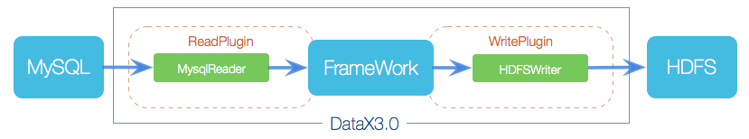

# Datax


## **一、背景：**

数据采集需求不断增加：

1. 各类结构化数据（oracle、mysql、sqlserver）
2. 日志采集（accesslog、service log）
每日采集总量越来越大，采集任务数越来越多，任务调度情况更加复杂

现有的采集工具存在一些缺陷：

1. 闭源商业软件，不支持二次开发，个性化需求很难满足

2. tdt目前不支持多节点高可用，单节点故障之后采集会中断

3. jdbc连接数限制，采集速度慢，采集大表会失败

4. 只能在图形界面单表配置，无法整库采集


## 二、datax简介

​    DataX 是阿里巴巴集团内被广泛使用的离线数据同步工具/平台，实现包括  MySQL、Oracle、SqlServer、Postgre、HDFS、Hive、ADS、HBase、TableStore(OTS)、MaxCompute(ODPS)、DRDS 等各种异构数据源之间高效的数据同步功能。

​    DataX在阿里巴巴集团内承担了所有大数据的离线同步业务，并已持续稳定运行了6年之久。目前每天完成同步8w多道作业，每日传输数据量超过300TB。


todo: 补充启动方式，配置说明

## 三、DataX原理

[参考资料1]: https://blog.csdn.net/weixin_43550228/article/details/88823710 "CSDN"
[参考资料2]: https://github.com/alibaba/DataX "github"

### 3.1DataX框架设计



​    采用Framework + plugin架构构建。将数据源读取和写入抽象成为Reader/Writer插件，纳入到整个同步框架中。

- ​    Reader：Reader 为数据采集模块，负责采集数据源的数据，将数据发送给Framework。
- ​    Writer： Writer 为数据写入模块，负责不断向Framework取数据，并将数据写入到目的端。
- ​    Framework：Framework用于连接reader和writer，作为两者的数据传输通道，并处理缓冲，流控，并发，数据转换等核心技术问    题。

### 3.2DataX核心构架


- DataX完成单个数据同步的作业，称之为Job，DataX接受到一个Job之后，将启动一个进程来完成整个作业同步过程，DataX Job模块是单个作业的中枢管理节点，承担了数据清理、子任务切分(将单一作业计算转化为多个子Task)、TaskGroup管理等功能。
- DataXJob启动后，会根据不同的源端切分策略，将Job切分成多个小的Task(子任务)，以便于并发执行。Task是DataX作业的最小单元，每一个Task都会负责一部分数据的同步工作。
- 切分多个Task之后，DataX Job会调用Scheduler模块，根据配置的并发数据量，将拆分成的Task重新组合，组装成TaskGroup(任务组)。每一个TaskGroup负责以一定的并发运行完毕分配好的所有Task。
- 每一个Task都由TaskGroup负责启动，Task启动后，会固定启动Reader—>Channel—>Writer的线程来完成任务同步工作。
- DataX作业运行起来之后， Job监控并等待多个TaskGroup模块任务完成，等待所有TaskGroup任务完成后Job成功退出。


**DataX调度案例：**

举例来说，用户提交了一个DataX作业，并且配置了20个并发，目的是将一个100张分表的mysql数据同步到odps里面。	DataX的调度决策思路是：

1. DataXJob根据分库分表切分成了100个Task。
2. 根据20个并发，DataX计算共需要分配4个TaskGroup。
3. 4个TaskGroup平分切分好的100个Task，每一个TaskGroup负责以5个并发共计运行25个Task。

### 3.3插件视角看任务调度

框架按照如下的顺序执行`Job`和`Task`的接口：


上图中，黄色表示`Job`部分的执行阶段，蓝色表示`Task`部分的执行阶段，绿色表示框架执行阶段。


- `Job`: `Job`是DataX用以描述从一个源头到一个目的端的同步作业，是DataX数据同步的最小业务单元。比如：从一张mysql的表同步到odps的一个表的特定分区。
- `Task`: `Task`是为最大化而把`Job`拆分得到的最小执行单元。比如：读一张有1024个分表的mysql分库分表的`Job`，拆分成1024个读`Task`，用若干个并发执行。
- `TaskGroup`:  描述的是一组`Task`集合。在同一个`TaskGroupContainer`执行下的`Task`集合称之为`TaskGroup`
- `JobContainer`:  `Job`执行器，负责`Job`全局拆分、调度、前置语句和后置语句等工作的工作单元。类似Yarn中的JobTracker
- `TaskGroupContainer`: `TaskGroup`执行器，负责执行一组`Task`的工作单元，类似Yarn中的TaskTracker。


`Job`接口功能如下：

- `init`: Job对象初始化工作，测试可以通过`super.getPluginJobConf()`获取与本插件相关的配置。读插件获得配置中`reader`部分，写插件获得`writer`部分。
- `prepare`: 全局准备工作，比如odpswriter清空目标表。
- `split`: 拆分`Task`。参数`adviceNumber`框架建议的拆分数，一般是运行时所配置的并发度。值返回的是`Task`的配置列表。
- `post`: 全局的后置工作，比如mysqlwriter同步完影子表后的rename操作。
- `destroy`: Job对象自身的销毁工作。

`Task`接口功能如下：

- `init`：Task对象的初始化。此时可以通过`super.getPluginJobConf()`获取与本`Task`相关的配置。这里的配置是`Job`的`split`方法返回的配置列表中的其中一个。
- `prepare`：局部的准备工作。
- `startRead`: 从数据源读数据，写入到`RecordSender`中。`RecordSender`会把数据写入连接Reader和Writer的缓存队列。
- `startWrite`：从`RecordReceiver`中读取数据，写入目标数据源。`RecordReceiver`中的数据来自Reader和Writer之间的缓存队列。
- `post`: 局部的后置工作。
- `destroy`: Task象自身的销毁工作。

### 3.4 DataX源码分析

#### 3.4.1框架结构

1. common: 基础公共类的定义,包括元素,异常类,统计类,读写接口定义等
2. core : 框架核心运行类,包括任务执行容器类等


3. 关系型数据库读写公用抽象插件:plugin-rdbms-util

4. 非结构化数据读写公用抽象插件:plugin-unstructured-storage-util

5. 各类具体的读写插件

   

   


#### 3.4.2源码分析


[参考链接]: https://www.jianshu.com/p/e63c40434fc1

1.**启动脚本：datax.py**

主要工作：构建java启动命令，启动进程，构建任务json模板

从java命令中看出程序入口类：com.alibaba.datax.core.Engine

```python
if __name__ == "__main__":
    printCopyright()                                              
    parser = getOptionParser()
    options, args = parser.parse_args(sys.argv[1:])
    if options.reader is not None and options.writer is not None:         # 命令中带有reader/writer类型，
        generateJobConfigTemplate(options.reader,options.writer)          # 可以自动构建任务json模板
        sys.exit(RET_STATE['OK'])
    if len(args) != 1:
        parser.print_help()
        sys.exit(RET_STATE['FAIL'])

    startCommand = buildStartCommand(options, args)                       # 构建java启动命令
    # print startCommand

    child_process = subprocess.Popen(startCommand, shell=True)            # 启动进程
    register_signal()
    (stdout, stderr) = child_process.communicate()

    sys.exit(child_process.returncode)
```

```python
ENGINE_COMMAND = "java -server ${jvm} %s -classpath %s  ${params} com.alibaba.datax.core.Engine -mode ${mode} -jobid ${jobid} -job ${job}" % (DEFAULT_PROPERTY_CONF, CLASS_PATH)
```

2. **Engine**

主要工作：解析命令行参数,并初始化任务执行容器JobContainer

main函数主要catch了一下异常，并将异常信息打印出来，实际执行在entry函数中

```java
public class Engine {
    public static void main(String[] args) throws Exception {       
        int exitCode = 0;
        try {
            Engine.entry(args);                                          /*进入entry*/
        } catch (Throwable e) {
            exitCode = 1;
            LOG.error("\n\n经DataX智能分析,该任务最可能的错误原因是:\n" + ExceptionTracker.trace(e));

            if (e instanceof DataXException) {
                DataXException tempException = (DataXException) e;
                ErrorCode errorCode = tempException.getErrorCode();
                if (errorCode instanceof FrameworkErrorCode) {
                    FrameworkErrorCode tempErrorCode = (FrameworkErrorCode) errorCode;
                    exitCode = tempErrorCode.toExitValue();
                }
            }

            System.exit(exitCode);
        }
        System.exit(exitCode);
    }

}
```

entry函数主要功能：

1. 解析了java命令行的三个参数，分别是job、jobid和mode，其中job是用户配置的json文件路径，jobid和mode是python文件带进来的，单机模式下可以忽略改参数
2. 读取用户配置的json文件，转化为内部的configuration配置
3. 打印相关信息，并校验json文件的合法性
4. 启动engine执行

```java
public static void entry(final String[] args) throws Throwable {
        Options options = new Options();                                   /*解析命令行参数*/
        options.addOption("job", true, "Job config.");
        options.addOption("jobid", true, "Job unique id.");
        options.addOption("mode", true, "Job runtime mode.");

        BasicParser parser = new BasicParser();
        CommandLine cl = parser.parse(options, args);

        String jobPath = cl.getOptionValue("job");

        // 如果用户没有明确指定jobid, 则 datax.py 会指定 jobid 默认值为-1
        String jobIdString = cl.getOptionValue("jobid");
        RUNTIME_MODE = cl.getOptionValue("mode");
                                                                           
        Configuration configuration = ConfigParser.parse(jobPath);        /*读取任务json配置文件*/

        long jobId;
        if (!"-1".equalsIgnoreCase(jobIdString)) {                        /*判断是否本地模式*/
            jobId = Long.parseLong(jobIdString);
        } 
    
         ....其他代码....

        ConfigurationValidate.doValidate(configuration);                 /*校验配置文件*/
        Engine engine = new Engine();
        engine.start(configuration);                                     /*开始任务，进入start方法*/
    }
```

start函数中主要功能：

1. 列转换默认值，即动态在configuration中注入默认值
2. 初始化插件的LoadUtil，后面classLoader相关操作都会依赖这个函数
3. 初始化JobContainer并启动

```java
public void start(Configuration allConf) {

        // 绑定column转换信息
        ColumnCast.bind(allConf);

        /**
         * 初始化PluginLoader，可以获取各种插件配置
         */
        LoadUtil.bind(allConf);
      
        ....其他代码....
         
        int channelNumber =0;                            /*channel表示通道数,相当于最小分割任务的数量*/
        AbstractContainer container;
        
        if (isJob) {                                     /* 
                                                            创建JobContainer
                                                            如果是单机模式,则初始化JobContainer
                                                            JobContainer包含多个TaskGroupContainer
                                                         */
            allConf.set(CoreConstant.DATAX_CORE_CONTAINER_JOB_MODE, RUNTIME_MODE);
            container = new JobContainer(allConf);
            instanceId = allConf.getLong(
                    CoreConstant.DATAX_CORE_CONTAINER_JOB_ID, 0);

        } else {
            container = new TaskGroupContainer(allConf);
            instanceId = allConf.getLong(
                    CoreConstant.DATAX_CORE_CONTAINER_JOB_ID);
            taskGroupId = allConf.getInt(
                    CoreConstant.DATAX_CORE_CONTAINER_TASKGROUP_ID);
            channelNumber = allConf.getInt(
                    CoreConstant.DATAX_CORE_CONTAINER_TASKGROUP_CHANNEL);
        }

         ....其他代码....
             
        
        //初始化PerfTrace                                     /*打开PerfTrjoaceb结束后做汇总汇报*/
        PerfTrace perfTrace = PerfTrace.getInstance(isJob, instanceId, taskGroupId, priority, traceEnable);
        perfTrace.setJobInfo(jobInfoConfig,perfReportEnable,channelNumber);    
        container.start();                                   /*启动JobContainer*/

    }
```

job实例运行在jobContainer容器中，它是所有任务的master，负责初始化、拆分、调度、运行、回收、监控和汇报, 但它并不做实际的数据同步操作。

JobContainer从名称上看就是Job的容器,大体可以认为是管理调度读写插件的Job实例。

JobContainer继承于AbstractContainer类，start()是JobContainer的成员方法。


```java
public void start() {
        LOG.info("DataX jobContainer starts job.");

        boolean hasException = false;
        boolean isDryRun = false;
        try {
            this.startTimeStamp = System.currentTimeMillis();
            isDryRun = configuration.getBool(CoreConstant.DATAX_JOB_SETTING_DRYRUN, false);
            if(isDryRun) {
                LOG.info("jobContainer starts to do preCheck ...");
                this.preCheck();
            } else {
                userConf = configuration.clone();                        /*克隆配置文件*/ 
                LOG.debug("jobContainer starts to do preHandle ...");
                this.preHandle();                                        /*前置处理*/

                LOG.debug("jobContainer starts to do init ...");
                this.init();                                             /*初始化*/
                LOG.info("jobContainer starts to do prepare ...");
                this.prepare();                                          /*读写插件的准备工作，比如                                                                                      ElasticSearchWriter会创建索引，                                                                            HDFSWriter去校验目录是否存在等
                                                                         */
                LOG.info("jobContainer starts to do split ...");
                this.totalStage = this.split();                          /*切分任务，根据通道数，对读写任务进行                                                                          拆分
                                                                         */
                LOG.info("jobContainer starts to do schedule ...");
                this.schedule();                                         /*schedule首先完成的工作是把上一步                                                                              reader和writer split的结果整合到                                                                            具体taskGroupContainer中,同时不                                                                            同的执行模式调用不同的调度策略，将所                                                                            有任务调度起来
                                                                        */
                LOG.debug("jobContainer starts to do post ...");
                this.post();                                             /*任务完成后通知任务汇报*/

                LOG.debug("jobContainer starts to do postHandle ...");
                this.postHandle();                                       /*任务完成后处理*/
                LOG.info("DataX jobId [{}] completed successfully.", this.jobId);

                this.invokeHooks();                                      
            }
        } 
    
             ....其他代码....
                 
       
            if(!isDryRun) {

                this.destroy();                                         /*销毁、打印统计信息*/
                this.endTimeStamp = System.currentTimeMillis();
                if (!hasException) {
                    //最后打印cpu的平均消耗，GC的统计
                    VMInfo vmInfo = VMInfo.getVmInfo();
                    if (vmInfo != null) {
                        vmInfo.getDelta(false);
                        LOG.info(vmInfo.totalString());
                    }

                    LOG.info(PerfTrace.getInstance().summarizeNoException());
                    this.logStatistics();
                }
            }
        }
    }
```

3.reader插件

所有的reader插件都继承于一个Reader抽象类，每个Reader插件在其内部内部实现Job、Task两个内部类

```
public abstract class Reader extends BaseObject {

	/**
	 * 每个Reader插件必须实现Job内部类。
	 * 
	 * */
	public static abstract class Job extends AbstractJobPlugin {

		/**
		 * 切分任务
		 * 
		 * @param adviceNumber
		 * 
		 * 着重说明下，adviceNumber是框架建议插件切分的任务数，插件开发人员最好切分出来的任务数>=adviceNumber。
		 *
		 * 之所以采取这个建议是为了给用户最好的实现，例如框架根据计算认为用户数据存储可以支持100个并发连接，并且用户认为需          * 要100个并发。 此时，插件开发人员如果能够根据上述切分规则进行切分并做到>=100连接信息，DataX就可以同时启动100个          * Channel，这样给用户最好的吞吐量 <br>
		 * 例如用户同步一张Mysql单表，但是认为可以到10并发吞吐量，插件开发人员最好对该表进行切分，比如使用主键范围切分，
		 * 并且如果最终切分任务数到>=10，我们就可以提供给用户最大的吞吐量。 <br>
		 * <br>
		 * 当然，我们这里只是提供一个建议值，Reader插件可以按照自己规则切分。但是我们更建议按照框架提供的建议值来切分。 <br>
		 * <br>
		 * 对于ODPS写入OTS而言，如果存在预排序预切分问题，这样就可能只能按照分区信息切分，无法更细粒度切分，
		 *  这类情况只能按照源头物理信息切分规则切分。 <br>
		 * <br>
		 * */
		public abstract List<Configuration> split(int adviceNumber);
	}

	public static abstract class Task extends AbstractTaskPlugin {
		public abstract void startRead(RecordSender recordSender);
	}
}
```

看一个具体的reader插件：OracleReader插件，OracleReader的Job内部类和Task内部类中的commonRdbmsReaderJob和commonRdbmsReaderTask来自于一个通用的RDBMS类：CommonRdbmsReader，所以主要内容看CommonRdbmsReader.Job和CommonRdbmsReader.Task

Job类

```java
public static class Job {
        private static final Logger LOG = LoggerFactory
                .getLogger(Job.class);

        public Job(DataBaseType dataBaseType) {
            OriginalConfPretreatmentUtil.DATABASE_TYPE = dataBaseType;
            SingleTableSplitUtil.DATABASE_TYPE = dataBaseType;
        }

        public void init(Configuration originalConfig) {

            OriginalConfPretreatmentUtil.doPretreatment(originalConfig);

            LOG.debug("After job init(), job config now is:[\n{}\n]",
                    originalConfig.toJSON());
        }

        
        public void preCheck(Configuration originalConfig,DataBaseType dataBaseType) {
               /*检查每个表是否有读权限，以及querySql跟splik Key是否正确*/
            
            ....其他代码....
                
        }


        public List<Configuration> split(Configuration originalConfig,
                                         int adviceNumber) {
            return ReaderSplitUtil.doSplit(originalConfig, adviceNumber);
        }

        public void post(Configuration originalConfig) {           /*job主要的功能：对配置文件进行拆分*/
            // do nothing
        }

        public void destroy(Configuration originalConfig) {
            // do nothing
        }

    }
```


Task类：

```java
public static class Task {
        private static final Logger LOG = LoggerFactory
                .getLogger(Task.class);
        private static final boolean IS_DEBUG = LOG.isDebugEnabled();
        protected final byte[] EMPTY_CHAR_ARRAY = new byte[0];

        private DataBaseType dataBaseType;
        private int taskGroupId = -1;
        private int taskId=-1;

        private String username;
        private String password;
        private String jdbcUrl;
        private String mandatoryEncoding;

        // 作为日志显示信息时，需要附带的通用信息。比如信息所对应的数据库连接等信息，针对哪个表做的操作
        private String basicMsg;

        public Task(DataBaseType dataBaseType) {
            this(dataBaseType, -1, -1);
        }

        public Task(DataBaseType dataBaseType,int taskGropuId, int taskId) {
            this.dataBaseType = dataBaseType;
            this.taskGroupId = taskGropuId;
            this.taskId = taskId;
        }

        public void init(Configuration readerSliceConfig) {       /*初始化，获取拆分好的配置文件、数据库信等*/

			/* for database connection */

            this.username = readerSliceConfig.getString(Key.USERNAME);
            this.password = readerSliceConfig.getString(Key.PASSWORD);
            this.jdbcUrl = readerSliceConfig.getString(Key.JDBC_URL);
            
            ....其他代码....
                
                
        }
      /* startRead方法主要实现了对查询语句的拆分、链接数据库、执行查询、统计任务信息、
       * 将查询结果的每条记录按照DataX的内部类型发送到startRead
       * RecordSender是一个中转类,它会吧数据传送给channel通道中,供写插件提取
      */
        public void startRead(Configuration readerSliceConfig,
                              RecordSender recordSender,
                              TaskPluginCollector taskPluginCollector, int fetchSize) {
            String querySql = readerSliceConfig.getString(Key.QUERY_SQL);
            String table = readerSliceConfig.getString(Key.TABLE);

            

            Connection conn = DBUtil.getConnection(this.dataBaseType, jdbcUrl,
                    username, password);

            ....其他代码....
            

            int columnNumber = 0;
            ResultSet rs = null;
            try {
            ....其他代码....
                
                while (rs.next()) {
                    rsNextUsedTime += (System.nanoTime() - lastTime);
                    this.transportOneRecord(recordSender, rs,
                            metaData, columnNumber, mandatoryEncoding, taskPluginCollector);
                    lastTime = System.nanoTime();
                }

               ....其他代码....        
        }

        public void post(Configuration originalConfig) {
            // do nothing
        }

        public void destroy(Configuration originalConfig) {
            // do nothing
        }
        
               ....其他代码....
        protected Record buildRecord(RecordSender recordSender,ResultSet rs, ResultSetMetaData metaData, int columnNumber, String mandatoryEncoding,
        		TaskPluginCollector taskPluginCollector) {
        	Record record = recordSender.createRecord();

            try {
                for (int i = 1; i <= columnNumber; i++) {
                    switch (metaData.getColumnType(i)) {

                    case Types.CHAR:
                    case Types.NCHAR:
                    case Types.VARCHAR:
                    case Types.LONGVARCHAR:
                    case Types.NVARCHAR:
                    case Types.LONGNVARCHAR:
                        String rawData;
                        if(StringUtils.isBlank(mandatoryEncoding)){
                            rawData = rs.getString(i);
                        }else{
                            rawData = new String((rs.getBytes(i) == null ? EMPTY_CHAR_ARRAY : 
                                rs.getBytes(i)), mandatoryEncoding);
                        }
                        record.addColumn(new StringColumn(rawData));
                        break;

                    case Types.CLOB:
                    case Types.NCLOB:
                        record.addColumn(new StringColumn(rs.getString(i)));
                        break;

                    case Types.SMALLINT:
                    case Types.TINYINT:
                    case Types.INTEGER:
                    case Types.BIGINT:
                        record.addColumn(new LongColumn(rs.getString(i)));
                        break;

                    case Types.NUMERIC:
                    case Types.DECIMAL:
                        record.addColumn(new DoubleColumn(rs.getString(i)));
                        break;

                    case Types.FLOAT:
                    case Types.REAL:
                    case Types.DOUBLE:
                        record.addColumn(new DoubleColumn(rs.getString(i)));
                        break;

                    case Types.TIME:
                        record.addColumn(new DateColumn(rs.getTime(i)));
                        break;

                    // for mysql bug, see http://bugs.mysql.com/bug.php?id=35115
                    case Types.DATE:
                        if (metaData.getColumnTypeName(i).equalsIgnoreCase("year")) {
                            record.addColumn(new LongColumn(rs.getInt(i)));
                        } else {
                            record.addColumn(new DateColumn(rs.getDate(i)));
                        }
                        break;

                    case Types.TIMESTAMP:
                        record.addColumn(new DateColumn(rs.getTimestamp(i)));
                        break;

                    case Types.BINARY:
                    case Types.VARBINARY:
                    case Types.BLOB:
                    case Types.LONGVARBINARY:
                        record.addColumn(new BytesColumn(rs.getBytes(i)));
                        break;

                    // warn: bit(1) -> Types.BIT 可使用BoolColumn
                    // warn: bit(>1) -> Types.VARBINARY 可使用BytesColumn
                    case Types.BOOLEAN:
                    case Types.BIT:
                        record.addColumn(new BoolColumn(rs.getBoolean(i)));
                        break;

                    case Types.NULL:
                        String stringData = null;
                        if(rs.getObject(i) != null) {
                            stringData = rs.getObject(i).toString();
                        }
                        record.addColumn(new StringColumn(stringData));
                        break;

                    default:
                        throw DataXException
                                .asDataXException(
                                        DBUtilErrorCode.UNSUPPORTED_TYPE,
                                        String.format(
                                                "您的配置文件中的列配置信息有误. 因为DataX 不支持数据库读取这种字段类型. 字段名:[%s], 字段名称:[%s], 字段Java类型:[%s]. 请尝试使用数据库函数将其转换datax支持的类型 或者不同步该字段 .",
                                                metaData.getColumnName(i),
                                                metaData.getColumnType(i),
                                                metaData.getColumnClassName(i)));
                    }
                }
            } catch (Exception e) {
                if (IS_DEBUG) {
                    LOG.debug("read data " + record.toString()
                            + " occur exception:", e);
                }
                //TODO 这里识别为脏数据靠谱吗？
                taskPluginCollector.collectDirtyRecord(record, e);
                if (e instanceof DataXException) {
                    throw (DataXException) e;
                }
            }
            return record;
        }
    }
```

4. Writer插件

   所有的Writer插件都继承于一个Writer抽象类，每个Writer插件在其内部内部实现Job、Task两个内部类

```java
public abstract class Writer extends BaseObject {
   /**
    * 每个Writer插件必须实现Job内部类
    */
   public abstract static class Job extends AbstractJobPlugin {
      /**
       * 切分任务。<br>
       * 
       * @param mandatoryNumber
       *            为了做到Reader、Writer任务数对等，这里要求Writer插件必须按照源端的切分数进行切分。否则框架报错！
       * 
       * */
      public abstract List<Configuration> split(int mandatoryNumber);
   }

   /**
    * 每个Writer插件必须实现Task内部类
    */
   public abstract static class Task extends AbstractTaskPlugin {

      public abstract void startWrite(RecordReceiver lineReceiver);

      public boolean supportFailOver(){return false;}
   }
}
```


看一个具体的Writer插件：HdfsWriter

Job类：主要实现了job初始化、参数检查、配置文件拆分、创建HDFS临时目录


Task类：主要实现了task初始化、接收拆分后的配置文件、向HDFS中写入TEXT FILE或ORC FILE


再看任务调度：

schedule首先完成的工作是把上一步reader和writer split的结果整合到具体taskGroupContainer中，同时不同的执行模式调用不同的调度策略，将所有任务调度起来

目前已开源的代码只支持**StandAlone**调度方式，由StandAloneScheduler类实现，StandAloneScheduler类继承ProcessInnerScheduler类，ProcessInnerScheduler类继承AbstractScheduler类，schedule方法在AbstractScheduler中实现。

```java
public void schedule(List<Configuration> configurations) {
        Validate.notNull(configurations,
                "scheduler配置不能为空");                                         /*报告间隔时间*/
        int jobReportIntervalInMillSec = configurations.get(0).getInt(
                CoreConstant.DATAX_CORE_CONTAINER_JOB_REPORTINTERVAL, 30000);
        int jobSleepIntervalInMillSec = configurations.get(0).getInt(
                CoreConstant.DATAX_CORE_CONTAINER_JOB_SLEEPINTERVAL, 10000);

        this.jobId = configurations.get(0).getLong(
                CoreConstant.DATAX_CORE_CONTAINER_JOB_ID);

        errorLimit = new ErrorRecordChecker(configurations.get(0));

        /**
         * 给 taskGroupContainer 的 Communication 注册
         */
        this.containerCommunicator.registerCommunication(configurations);

        int totalTasks = calculateTaskCount(configurations);
        startAllTaskGroup(configurations);

        Communication lastJobContainerCommunication = new Communication();

        long lastReportTimeStamp = System.currentTimeMillis();
        try {
            while (true) {                                           /*无限循环(直到同步作业的状态为成功状态)
                                                                      * 这个无限循环的意义在于同步作业进行的时                                                                       *候,它会以报告周期时间不断的打印进行的状                                                                       *态
                                                                      */
                /**
                 * step 1: collect job stat
                 * step 2: getReport info, then report it
                 * step 3: errorLimit do check
                 * step 4: dealSucceedStat();
                 * step 5: dealKillingStat();
                 * step 6: dealFailedStat();
                 * step 7: refresh last job stat, and then sleep for next while
                 *
                 * above steps, some ones should report info to DS
                 *
                 */
                Communication nowJobContainerCommunication = this.containerCommunicator.collect();
                nowJobContainerCommunication.setTimestamp(System.currentTimeMillis());
                LOG.debug(nowJobContainerCommunication.toString());

                //汇报周期
                long now = System.currentTimeMillis();
                if (now - lastReportTimeStamp > jobReportIntervalInMillSec) {
                    Communication reportCommunication = CommunicationTool
                            .getReportCommunication(nowJobContainerCommunication, lastJobContainerCommunication, totalTasks);

                    this.containerCommunicator.report(reportCommunication);
                    lastReportTimeStamp = now;
                    lastJobContainerCommunication = nowJobContainerCommunication;
                }

                errorLimit.checkRecordLimit(nowJobContainerCommunication);

                                                                      /*直到同步作业的状态为成功,退出循环*/
                
                if (nowJobContainerCommunication.getState() == State.SUCCEEDED) {
                    LOG.info("Scheduler accomplished all tasks.");
                    break;
                }

                if (isJobKilling(this.getJobId())) {
                    dealKillingStat(this.containerCommunicator, totalTasks);
                } else if (nowJobContainerCommunication.getState() == State.FAILED) {
                    dealFailedStat(this.containerCommunicator, nowJobContainerCommunication.getThrowable());
                }

                Thread.sleep(jobSleepIntervalInMillSec);
            }
        } catch (InterruptedException e) {
            // 以 failed 状态退出
            LOG.error("捕获到InterruptedException异常!", e);

            throw DataXException.asDataXException(
                    FrameworkErrorCode.RUNTIME_ERROR, e);
        }

    }
```

startAllTaskGroup方法在ProcessInnerScheduler中实现：

```
public void startAllTaskGroup(List<Configuration> configurations) {
    //首先创建一个固定数量的线程池,数量为taskGroup的数量
    this.taskGroupContainerExecutorService = Executors
            .newFixedThreadPool(configurations.size());
    //循环taskGroup配置
    for (Configuration taskGroupConfiguration : configurations) {
        //创建taskGroup运行器
        TaskGroupContainerRunner taskGroupContainerRunner = newTaskGroupContainerRunner(taskGroupConfiguration);
        //放到线程池中运行
        this.taskGroupContainerExecutorService.execute(taskGroupContainerRunner);
    }
    //关闭线程池
    this.taskGroupContainerExecutorService.shutdown();
}
```


## 四、datax-web简介

​    DataX集成可视化页面，选择数据源一键生成JSON并脱敏，集成定时任务，支持分布式，支持增量获取，实时查看运行日志，监控执行器资源，kill运行进程。

​    DataX阿里在开源的时候并未提供任何可视化界面，我们在使用的过程中，需要将Json配置文件放到DataX的job路径下，随着业务的增加，配置文件不方便管理和迁移并且每次执行都需要记录命令。目前DataX只支持单机版，多节点之间的协作不能控制，我们希望能有一款有友好的可视化界面，支持定时任务,支持分布式的数据同步，这也是该项目的目标。

## 五、待完善事项

需新增功能：

1、datax-web添加数据源时，支持inceptor驱动，原生只支持高版本hive

2、datax-web添加HDFS数据源

3、

